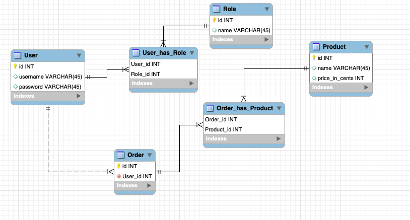

# Online store 

A cosmetics online store selling different cosmetics products. The product list lists the name and the price of every product. One product can be in many orders, and one order can have multiple products.

After logging in, the user can both browse and order the products. The products can be ordered by selecting the desired products and pressing "Add to order" button. 

## Features

- Logging in and registering
- Browsing products
- Ordering products
- Reviewing orders
- Adding products (admin)
- Deleting and editing products (admin)


## Demo

A link to the production:

https://lacolegiala-online-store.herokuapp.com

## Database schema



CREATE TABLE statements:


```
CREATE TABLE role (
id INTEGER NOT NULL,
name VARCHAR(80),
PRIMARY KEY (id), 
UNIQUE (name)
);
```

```
CREATE TABLE account (

	id INTEGER NOT NULL, 
	date_created DATETIME, 
	date_modified DATETIME, 
	username VARCHAR(144) NOT NULL, 
	password VARCHAR(144) NOT NULL, 
	active BOOLEAN, 
	PRIMARY KEY (id), 
	CHECK (active IN (0, 1))
);
````

```
CREATE TABLE product (

	id INTEGER NOT NULL, 
	date_created DATETIME, 
	date_modified DATETIME, 
	name VARCHAR(144) NOT NULL, 
	price INTEGER NOT NULL, 
	PRIMARY KEY (id)
);
```
```
CREATE TABLE roles_users (

	user_id INTEGER, 
	role_id INTEGER, 
	FOREIGN KEY(user_id) REFERENCES account (id), 
	FOREIGN KEY(role_id) REFERENCES role (id)
);
```

```
CREATE TABLE store_order (

	id INTEGER NOT NULL, 
	date_created DATETIME, 
	date_modified DATETIME, 
	user_id INTEGER NOT NULL, 
	PRIMARY KEY (id), 
	FOREIGN KEY(user_id) REFERENCES account (id)
);
```

```
CREATE TABLE store_order_has_product (

	store_order_id INTEGER NOT NULL, 
	product_id INTEGER NOT NULL, 
	PRIMARY KEY (store_order_id, product_id), 
	FOREIGN KEY(store_order_id) REFERENCES store_order (id), 
	FOREIGN KEY(product_id) REFERENCES product (id)
)
```


## Details

### How to use

The application works by going to the address linked under title "Demo". 

The user can login or register by clicking "Login" or "Register" links featured on the right at the navbar and filling out the form. The username for admin is "admin" and the password is "1234567890". Users log out by pressing "Logout" featured at the same place where the "Login" and "Register" buttons were before logging in.

Regular users can browse products on the front page. Ordering is made by clicking the checkboxes of the desired products and then the "Order selected items" button. The user can review their orders by clicking the "My orders" link featured at the navbar.

Admin can do everything that regular users can, and in addition add, edit and delete products. Products can be added by pressing the "Add a product" link on the left of the navbar and filling out the form. Editing and deleting features are at the product list ("List products" link at the navbar). Admin can edit the product by pressing the "Edit" link of the desired products. This will lead to the edit page, where there's a form where new values will be set. Deleting a product is done by just pressing "Remove".

### Installing the app

First, create Python virtual environment.

``python3 -m venv venv``

Next, activate it.

``source venv/bin/activate``

Install dependencies.

`pip install -r requirements.txt`

If you face this error when installing dependencies

`ld: library not found for -lssl`

try this:

```
export LDFLAGS="-L/usr/local/opt/openssl/lib"
export CPPFLAGS="-I/usr/local/opt/openssl/include"
```
Then try to install dependencies again.


