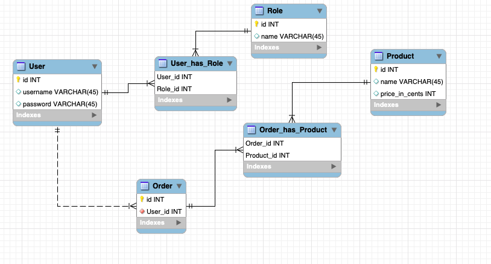

# Database documentation

## Database schema



## CREATE TABLE statements


```sql
CREATE TABLE role (
	id INTEGER NOT NULL,
	name VARCHAR(80),
	PRIMARY KEY (id), 
	UNIQUE (name)
);
```

```sql
CREATE TABLE account (
	id INTEGER NOT NULL, 
	date_created DATETIME, 
	date_modified DATETIME, 
	username VARCHAR(144) NOT NULL, 
	password VARCHAR(144) NOT NULL, 
	active BOOLEAN, 
	PRIMARY KEY (id), 
	CHECK (active IN (0, 1))
);
```

```sql
CREATE TABLE product (
	id INTEGER NOT NULL, 
	date_created DATETIME, 
	date_modified DATETIME, 
	name VARCHAR(144) NOT NULL, 
	price INTEGER NOT NULL, 
	PRIMARY KEY (id)
);
```
```sql
CREATE TABLE roles_users (
	user_id INTEGER, 
	role_id INTEGER, 
	FOREIGN KEY(user_id) REFERENCES account (id), 
	FOREIGN KEY(role_id) REFERENCES role (id)
);
```

```sql
CREATE TABLE store_order (
	id INTEGER NOT NULL, 
	date_created DATETIME, 
	date_modified DATETIME, 
	user_id INTEGER NOT NULL, 
	PRIMARY KEY (id), 
	FOREIGN KEY(user_id) REFERENCES account (id)
);
```

```sql
CREATE TABLE store_order_has_product (
	store_order_id INTEGER NOT NULL, 
	product_id INTEGER NOT NULL, 
	PRIMARY KEY (store_order_id, product_id), 
	FOREIGN KEY(store_order_id) REFERENCES store_order (id), 
	FOREIGN KEY(product_id) REFERENCES product (id)
)
```